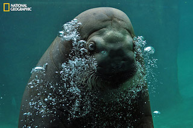
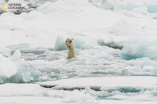
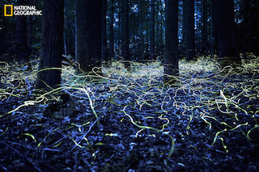

# Git Flow

## Objectives

* Get familiar with git syntax
* Get comfortable creating, merging, pushing, and pulling branches
* Resolve merge conflicts

## Lauren Here:
 
(╯°□°）╯︵ ┻━┻

## Instructions

Remember to fork and clone this lab if you haven't already.

### Background

For this lab, you're going to be pretending that you work for National Geographic's Photography contest and that your assignment is to make a quick mockup of what the home page will look like. You want to include photos from the past five winners on the page.

### Branching

Before altering your code base, open `index.html` in the browser. In the first part of this lab, you're going to add a photo of a turtle below the image of the tree to a branch then merge that branch into master.

* Type `git branch`. This should show you that you're on the master branch.
* Make a new branch called `add-turtle` from the master branch: `git branch add-turtle`
* Type `git branch` again. Now you should see `master` (highlighted) and `add-turtle` 
* Switch to the add-turtle branch: `git checkout add-turtle`
* Make sure you switched successfully by typing `git branch` again. This should return `master` and `add-turtle` (highlighted).
* In `index.html`, below the tree picture and caption section, add the turtle picture using the HTML below:

```html
<!-- begin turtle picture and caption -->
<div class="center-container">
  <div class="card">
    <div class="caption">
      <h4>From the Sky</h4>
      <p>Montse Grillo</p>
      <p>Tenerife, Canary Islands</p>
    </div>
  </div>
  <div class="card">
    
  </div>
</div>
<!-- end turtle picture and caption -->
```

* Open up your `index.html` and see how the page looks.
* Stage and commit your changes.

### Merging

Now that you've sucessfully added a turtle pic and caption to the add-turtle branch and staged and commited it, you're going to merge that branch into master.

* The first step is to switch back to the master branch: `git checkout master`
* Now you're going to merge the add-turtle branch in: `git merge add-turtle`
* Open up your `index.html` in the browser. How does it look? Does it have two pictures now? 

While you have this change locally, your remote repo (the one up on Github) still thinks that `index.html` just has one picture, the tree/bird one. You need to tell it about this update.
* Push the update to your master branch on your remote repo: `git push origin master`
* To make sure this push worked, visit your fork of this repo. From there, you can double check in at least two ways: 
  1. There will be a light blue bar above the file struture of the repo:
   that displays the most recent commit. This bar should have your GitHub picture followed by your GitHub name and a time stamp.
  2. Click on . The most recent commit, the one at the top, should be the one you made.

* Let's get local again: How many branches do you expect to see when you type `git branch`? How many are there? What does this tell you about merging?

### Deleting A Local Branch

Now that you've added the changes you've made from add-turtle to master, and master has been pushed to the remote repo successfully, it's time to delete your local version of add-turtle.

* Make sure you're on master: `git branch` should return `master` highlighted.
* Type `git branch -d add-turtle`
* To make sure this branch was sucessfully deleted, type `git branch`. You should only see `master` now.

### Creating a Merge Conflict

#### Walrus Branch

From `master`, make a new branch, `add-walrus`. On this branch, you're going to add the below code to `index.html`, under the tree and turtle pictures.

```html
<!-- begin walrus picture and caption -->
<div class="center-container">
  <div class="card">
    <div class="caption">
      <h4>Hello</h4>
      <p>Misty Gage</p>
      <p>Point Defiance Zoo, Tacoma, WA</p>
    </div>
  </div>
  <div class="card">
    
  </div>
</div>
<!-- end walrus picture and caption -->
```
**Remember to add and commit these changes.**

#### Polar Bear and Walrus Branch

**From the `add-walrus` branch, switch to `master`.** From `master`, make a new branch, `add-walrus-and-polar-bear`. On this branch, you're going to add the below code to `index.html`, under the tree and turtle pictures (the same location where you added the walrus photo).

```html
<!-- begin polar bear picture and caption -->
<div class="center-container">
  <div class="card">
    
  </div>
  <div class="card">
    <div class="caption">
      <h4>Arctic Hi Five</h4>
      <p>Colin Mackenzie</p>
      <p>Svalbard, northern Norway</p>
    </div>
  </div>
</div>
<!-- end polar bear picture and caption -->
```

Remember to add and commit these changes as well.

#### Merging with Conflicts

* From the `add-walrus-and-polar-bear branch`, merge the `add-walrus` branch: `git merge add-walrus`
* You'll probably see a message that looks like "Automatic merge failed; fix conflicts and then commit the result." This just means that you will have to open the files where there are merge conflicts, in this case `index.html`, and find the part that looks like:

```
<<<<<<< HEAD
HTML for polar bear
=======
HTML for walrus
>>>>>>> add-walrus
```

* Just decide which part of the markup you'd like to preserve: the first part from add-walrus-and-polar-bear, the second part from add-walrus, or both. Then delete the `<<<<HEAD`, `======`, and `>>>>>` parts.

* Fix the merge conflict in `index.html` so that index now has four photos: tree, turtle, walrus, and polar bear.
* Remember, if you have multiple files with merge conflicts, you'll have to repeat this process with each file. Once you're done selecting which code to retain, `git add` and `git commit` these changes. Now when you type `git status`, your terminal should not display "You have unmerged paths."

#### Pushing a Local Branch

Now you're going to create a `add-walrus-and-polar-bear` branch on your remote repo.

* From the branch `add-walrus-and-polar-bear`, push the code to a remote branch of the same title. You can do this in one line with: `git push origin add-walrus-and-polar-bear`.
* To ensure this push worked, head over to GitHub and view your forked repo. Click on the branch dropdown: , there should be the option to view the `add-walrus-and-polar-bear` branch.
* Now your master branch has a tree and a turtle while add-walrus-and-polar-bear has tree, walrus, and polar bear.
* Since you merged add-walrus into add-walrus-and-polar-bear, go ahead and delete it. Remember that you cannot "be" on the branch that you're trying to delete so make sure you're on add-walrus-and-polar-bear instead.

### Getting a Remote Branch

Many times when working in groups, a developer will branch off of master, add some code, then push this new branch to the remote repo for another developer to work on. 

Since you're working on this project alone, you're going to mimic the remote creation of a new branch. For the next section, you're going to pretend to be a team member, Lauren. Lauren likes to add emoticons to readmes.

#### Lauren Time

* The first step is to pretend to be Lauren.
* As Lauren, go to GitHub. From GitHub, go to your fork of this lab. From this interface, create a new branch called "add-fireflies" using the pictured interface below:
  * 
* Type "add-fireflies" then click on "Create branch: add-fireflies from 'master'", as pictured below:
  * 
* This will redirect you to a newly created branch on your remote repo called "add-fireflies". From here, click on `README.md`:
  * 
* Now click on the pencil icon, shown below:
  * 

* Near the top of the markup, below the "Objectives" section, add the text below:

```markdown

## Lauren Here:

(╯°□°）╯︵ ┻━┻

```

* Now the readme should look like this:
  * 

* Scroll to the bottom, add a commit message like "added table flip to readme", and click commit changes.
  * 
* Lauren's work here is done. You can go back to being you.

#### You Time

Now you need to get the changes that Lauren made.

* Update your remote-tracking branches by writing a fetch command: `git fetch origin add-fireflies` or `git fetch --all`
* Type `git branch`. You probably still only see `master` and `add-walrus-and-polar-bear`. Think about why this is.
* Checkout the branch Lauren created: `git checkout add-fireflies`
* Now type `git branch`. You should see three branches: `master`, `add-walrus-and-polar-bear`, and `add-fireflies` (highlighted)
* If you open the readme in Sublime from the add-fireflies branch, you should see Lauren's table flip addition.
* Still in the `add-fireflies` branch, add the HTML code below to `index.html`, below the turtle.

```html
<!-- begin fireflies picture and caption -->
<div class="center-container">
  <div class="card">
    
  </div>
  <div class="card">
    <div class="caption">
      <h4>Searching for Love</h4>
      <p>Spencer Black</p>
      <p>Blue ghost fireflies in Brevard, North Carolina</p>
    </div>
  </div>
</div>
<!-- end fireflies picture and caption -->
```

* Add and commit these changes (`git add index.html`, `git commit -m "add firefly img and caption`") before checking out to master (`git checkout master`). 
* From master, merge `add-fireflies` (`git merge add-fireflies`). Make sure all three pictures are there (tree, turtle, fireflies) before pushing up to your remote repository (`git push origin master`).
* Since you merged into master and pushed the changes to a remote respository, delete the local branch (`git branch -D add-fireflies`).
* Now it's time to delete the remote branch `add-fireflies` as it is now included in the master branch: `git push origin :add-fireflies`

### Visualization

Just to review, this is the chronological order of this lab complete with a diagram of the branches:


1. from master, create branch add-turtle
2. add turtle pic and caption to index.html
3. merge add-turtle into master, now master has tree and turtle pics
4. from master, create branch add-walrus
5. add walrus pic and caption
6. from master, create branch add-walrus-and-polar-bear
7. add polar bear pic and caption
8. merge add-walrus into add-walrus-and-polar-bear and fix merge conflicts - now branch has tree, turtle, polar bear, and walrus
9. "Lauren" makes branch add-fireflies off of master and adds an emoticon to the readme
11. add firefly pic and caption to add-firefly branch
12. merge add-firefly into master

Without looking at the diagram above, try and draw your own visualization. Take a picture of your work and add that image to the `public/img/` folder. Title your drawing "drawing.png".

### Quiz Time

From the master branch, replace the question marks in `spec/comprehension_spec.rb` with the answers. Every answer should be a string. To check your answers, run `learn`. (If you don't have the Learn gem installed, you'll need to do that first: `gem install learn-co`. If the `gem` command doesn't work, make sure you have a working installation of [Ruby](https://www.ruby-lang.org/en/).) Once every test is passing, submit a pull request using your master branch.

## Extra Credit

Merge `add-walrus-and-polar-bear` into master. Fix the merge conflicts and push the changes before deleting the local and remote `add-walrus-and-polar-bear` branches.

## Conclusion

Now you have:

* First Section
  * Created a branch
  * Staged and committed changes
  * Merged a feature branch into master
  * Pushed changes in master to a remote repository
  * Deleted a local branch
* Second Section
  * Created two branches off of master, each with "competing code"
  * Merged a feature branch into a feature branch
  * Resolved merge conflicts
  * Pushed a local branch to a remote repository
* Third Section
  * Created a remote branch and commited changes to it
  * Fetched the remote branch
  * Added changes to this fetched branch locally
  * Merged the fetched branch into master
  * Pushed master to a remote repository
  * Deleted a local branch
  * Deleted a remote branch
* Extra Credit
  * Practiced resolving merge conflicts, pushing, and deleting branches

## Resources
* [SourceTree Blog](http://blog.sourcetreeapp.com/) - [Merge or Rebase?](http://blog.sourcetreeapp.com/2012/08/21/merge-or-rebase/)
* [Pro Git](http://git-scm.com/book/) - [Chapter 3 Git Branching](http://git-scm.com/book/en/Git-Branching)
* [Pro Git](http://git-scm.com/book/) - [3.1 Git Branching - What a Branch Is](http://git-scm.com/book/en/Git-Branching-What-a-Branch-Is)
* [Pro Git](http://git-scm.com/book/) - [3.2 Git Branching - Basic Branching and Merging](http://git-scm.com/book/en/Git-Branching-Basic-Branching-and-Merging)
* [LearnGitBranching](http://pcottle.github.io/learnGitBranching/) - [Introduction Sequence: Branching in Git](http://pcottle.github.io/learnGitBranching/)

<p data-visibility='hidden'>View <a href='https://learn.co/lessons/git-flow' title='Git Flow'>Git Flow</a> on Learn.co and start learning to code for free.</p>
